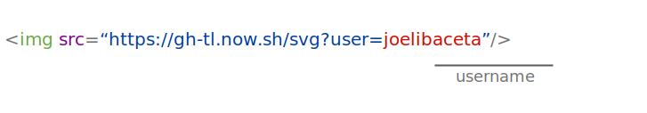

## GH-TL
Github Timeline Embedder

<br/>

## How to use?

Just use it as an image tag

 


Result


## Options


### Zoom ###

#### 0.5x ####

```html

```


#### 0.25x ####

```html

```


### Shape ###

#### Circle ####

```html

```


### Dark ###

#### true ####

```html

```


### Color ###

#### Blue (#38507a) ####

```html

```


#### Red (#dd4b3c) ####

```html

```


#### Pink (#ff4081)

```html

```


#### Purple (#8e44ad)

```html

```


<br/>

### How it works?

1. Receive a http request with the github username whose timeline want to embed
2. Make a GET request to github.com to get the profile page source code.
3. Scrap the html code to extract the timeline svg tag.
4. Prepare the final svg to return.
